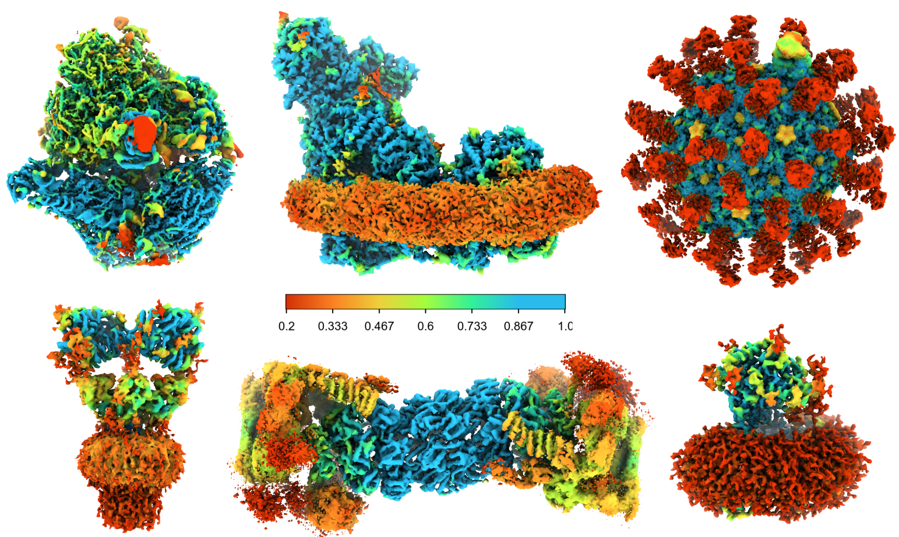

# OccuPy 

A fast and simple python module and program to estimate local scaling of cryo-EM maps, to approximate 
occupancy, and optionally also equalise the map according to occupancy while suppressing solvent amplification.




# Estimation of occupancy 
The primary purpose of `OccuPy` is to estimate the local map scale of cryo-EM maps. All regions in a cryo-EM map 
have pixel values that can be considered as drawn from some distribution. In well-resolved regions noise has been 
cancelled such that this distribution contains values above and below solvent. Decreased resolution or occupancy 
converesely results in values that are closer to solvent. `OccuPy` locates a region that exhibits the highest level 
above solvent, and utilizes this to place all other regions on a nominal scale between 0 and 1. This is a proxy for 
occupancy, under the assumption that there is limited flexibility. In maps exhibiting flexibility, the estimated 
map scale does not strictly represent occupancy, as `OccuPy` does not presently separate these factors in map value 
depreciation.

# Amplification of partial occupancies 
`OccuPy` can also equalise confidently estimated partial occupancy (local scale) in the input map , such that 
all regions of the output map are on the same nominal scale (100% occupancy). One can also specify an arbitrary 
multiplier for the difference between the input and equalised output map. Values below 0 signify further decreasing low 
occupancies, while maintaining higher occupancies. Values in the range [-1,1] are thus meaningful.

# Solvent supression 
Map scale amplification by inverse filtering would result in an extremely noisy output if solvent was permitted to 
be amplified. To mitigate this, `OccuPy` estimates a solvent model which limits the amplification of regions where 
the map scale is estimated as near-solvent. One can aid this estimation by providing a mask that covers non-solvent, 
permitting `OccuPy` to better identify solvent. This need not be prcise or accurate, and `OccuPy` will amplify map 
scale outside this region if it is confident about the scale in such a region . This is thus *not* a solvent mask in 
the traditional sense, but rather a solvent definition. Additionally, the estimation of the solvent model does NOT 
affect the estimated map scaling in any way, only the optional amplification.

The supression of solvent is not contigent on amplification - one can choose to supress solvent regions or not, 
irrespective of amplification. This acts as automatic solvent masking, to the extent that  `OccuPy` can reliably 
detect it.

# Expected input 
`OccuPy` expects an input map that has not been solvent-flattened (there should be some solvent somewhere in the map, 
the more the better). `OccuPy` may also work poorly where the map has been post-processed or altered by 
machine-learning, 
sharpening, or manual alterations. It has been designed to work in a classification setting, and as such does *not* 
require half-maps, a resolution estimate, or solvent mask. It will likely benefit if you are able to supply these 
things, but does not need it. 

## Installation
`OccuPy` can be installed from the [Python Package Index](https://pypi.org/) (PyPI)

```shell
pip3 install occupy
```

## Usage

`OccuPy` is a command-line tool 

```shell
$ OccuPy --help

 Usage: OccuPy [OPTIONS]                                                                                                                                              
                                                                                                                                                                      
 OccuPy takes a cryo-EM reconstruction produced by averaging and estimates a self-normative local map scaling. It can also locally alter confident partial            
 occupancies.                                                                                                                                                         
                                                                                                                                                                      
╭─ Options ──────────────────────────────────────────────────────────────────────────────────────────────────────────────────────────────────────────────────────────╮
│ *  --input-map           -i                        TEXT     Map to estimate [.mrc NxNxN] [default: None] [required]                                                │
│    --output_map          -o                        TEXT     Output map name [default: out_<input_file_name>]                                                       │
│    --amplify                 --no-amplify                   Alter partial occupancies, to make more or less equal to full occupancy? [default: no-amplify]         │
│    --amplify-amount                                FLOAT    How to alter confident partial occupancies [-1,1] [default: 1.0]                                       │
│    --amplify-limit                                 FLOAT    Hard limit below which map scale/occupancy will be considered unreliable for amplification             │
│                                                             [default: 0.05]                                                                                        │
│    --exclude-solvent         --retain-solvent               Should Estimated solvent be eliminated [flattened to 0]? [default: retain-solvent]                     │
│    --plot                    --no-plot                      Plot a histogram showing solvent model fit and occupancy confidence? [default: no-plot]                │
│    --lowpass-input                                 FLOAT    Low-pass filter the input map to this resoution prior to scale estimation. Internal default is         │
│                                                             6*pixel-size. [Å]                                                                                      │
│                                                             [default: None]                                                                                        │
│    --lowpass-amplified                             FLOAT    Optionally low-pass filter the amplified output to this resolution [Å] [default: None]                 │
│    --kernel-size                                   INTEGER  Size of the local occupancy estimation kernel [pixels] [default: None]                                 │
│    --hedge-confidence                              INTEGER  Exponent order for confidence estimation, such that values > 1 are more careful when amplifying low    │
│                                                             occupancies                                                                                            │
│                                                             [default: None]                                                                                        │
│    --solvent-def                                   TEXT     Mask that defines non-solvent, used to aid solvent model fitting. [.mrc NxNxN] [default: None]         │
│    --save-all-maps           --no-save-all-maps             Save all maps used internally [default: no-save-all-maps]                                              │
│    --save-chimerax           --no-save-chimerax             Write a .cxc file that can be opened by chimeraX to show colored input/output maps                     │
│                                                             [default: save-chimerax]                                                                               │
│    --verbose                 --quiet                        Let me know what's going on [default: quiet]                                                           │
│    --relion-classes                                TEXT     File of classes to diversify by occupancy amplification [_model.star] [default: None]                  │
│    --install-completion                                     Install completion for the current shell.                                                              │
│    --show-completion                                        Show completion for the current shell, to copy it or customize the installation.                       │
│    --help                                                   Show this message and exit.                                                                            │
╰────────────────────────────────────────────────────────────────────────────────────────────────────────────────────────────────────────────────────────────────────╯

```

but the tools used within it are available from within a python environment as well

```python
In [1]: import occupy

In [2]: occupy.occupancy.get_map_occupancy?                                                                          

Signature:
occupy.occupancy.get_map_occupancy(
    data: numpy.ndarray,
    occ_kernel: numpy.ndarray,
    sol_mask: numpy.ndarray = None,
    sol_threshold: float = None,
    save_occ_map: bool = False,
    verbose: bool = True,
)

```

# Examples of use 

In its basic form, `OccuPy` simply estimates the map scale, writes it out along with a chimeraX-command script to 
visualise the results easily

```shell
$ OccuPy -i map.mrc 
$ ls  
map.mrc    scale_map.mrc    chimX_map.cxc
```

To equalise all confident occupancies, use `--amplify`. Becuase you are manipulating the input image and not just 
estimating properties of it, there is now an output map as well. 
```shell
$ OccuPy -i map.mrc -o no_solvent.mrc --amplify 
$ ls  
map.mrc    scale_map.mrc    out_map.mrc    chimX_map.cxc
```

To supress (flatten) solvent content use `--exclude-solvent`
```shell
$ OccuPy -i map.mrc -o no_solvent.mrc --exclude-solvent 
```


