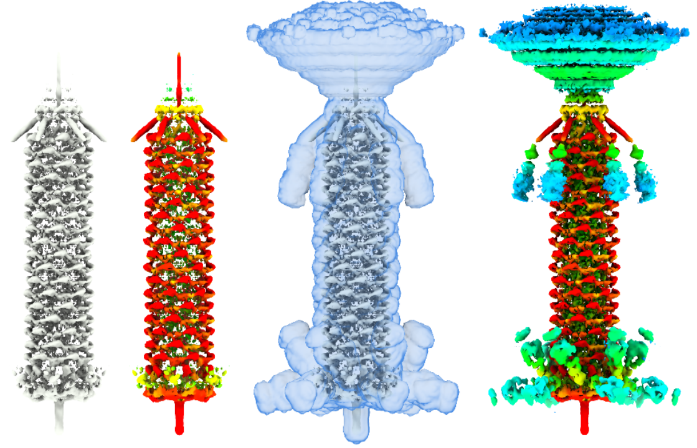

# Levo 

A fast and simple approach to estimate local scaling of cryo-EM maps, to approximate occupancy, and optionally to 
also equalise the map according to occupancy while suppressing solvent amplification.

# Estimation of occupancy 
The primary purpose of Levo is to estimate the local map scale of cryo-EM maps. All regions in a cryo-EM map 
have pixel values according to some distribution. In well-resolved regions this distribution contains values 
above and below solvent. Decreased resolution or occupancy results in values that are closer to solvent. Levo 
locates a region that exhibits the maximal such variation and utilizes this to place all other regions on a nominal 
scale between 0 and 1, as a proxy for occupancy. In Maps exhibiting varying resolution or flexibility, the estimated 
map scale does not strictly represent occupancy, as Levo does not deconvolute these factors in map value depreciation. 

# Occupancy Equalisation with solvent supression
Levo also attempts to equalise the input map according to occupancy, such that all regions are on the same nominal 
scale (100%). However, this type of inverse filtering would result in an extremely noisy output due to e.g. solvent 
amplification, where the estimated occupancy is typically very low. Levo therefore attempts to maks solvent by 
fitting a gaussian to the solvent peak of the input map histogram, which is then used to establish a lower limit, 
below which estimated occupancy should not be equalised. This estimation does not affect the estimated map scaling, 
and can be manually specified if incorrectly specified. 

# Requirements
Levo requires an input map that has not been solvent-flattened (there should be some solvent somewhere in the map, 
the more the better). In may also work poorly where the map has been post-processed or altered by machine-learning, 
sharpening, or manual alterations. It has been designed to work in a classification setting, and as such does *not* 
require half-maps, a resolution estimate, or solvent mask. It can benefit from these things, but does not need it. 

