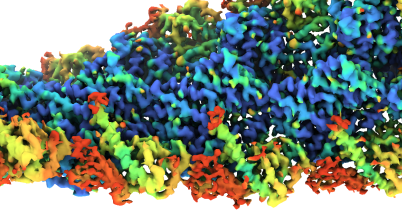

<!-- docs_generated_gallery -->

# Gallery 

Different examples of how Occupy has been used, and helped to visualise and analyze cryo-EM maps. 

---

## From the Paper

These are examples of how figures were generated for the main OccuPy paper. In some cases instructions are provided 
to reproduce the results. 

    <!--div class="figure align-default" id="idp1"-->
        
        

            
                <a class="reference internal" href="synthetic">
                    Occupy on synthetic maps 
                </a>
            
            <!--a class="headerlink" href="#idp1" title="Permalink to this image"></a-->
        

    <!--/div-->

    <!--div class="figure align-default" id="idp2"-->
        
        

            
                <a class="reference internal" href="mass">
                    Estimating atomic mass
                </a>
            
            <!--a class="headerlink" href="#idp2" title="Permalink to this image"></a-->
        

    <!--/div-->

    <!--div class="figure align-default" id="idp3"-->
        
        

            
                <a class="reference internal" href="membrane">
                    Detergent and membrane
                </a>
            
            <!--a class="headerlink" href="#idp3" title="Permalink to this image"></a-->
        

    <!--/div-->

---

## By the team 

    <!--div class="figure align-default" id="idt1"-->
        
        

            
                <a class="reference internal" href="highres">
                    At high resolution
                </a>
            
            <!--a class="headerlink" href="#idt1" title="Permalink to this image"></a-->
        

    <!--/div-->

    <!--div class="figure align-default" id="idt2"-->
        
        

            
                <a class="reference internal" href="filament">
                    Actin filament
                </a>
            
            <!--a class="headerlink" href="#idt2" title="Permalink to this image"></a-->
        

    <!--/div-->

[//]: # (

)

[//]: # ()
[//]: # ([:fontawesome-solid-download: Download all examples in Python source code: gallery_python.zip]&#40;./gallery_python.zip&#41;{ .md-button .center})

[//]: # ()
[//]: # ([:fontawesome-solid-download: Download all examples in Jupyter notebooks: gallery_jupyter.zip]&#40;./gallery_jupyter.zip&#41;{ .md-button .center})

[//]: # ()
[//]: # ()
[//]: # ([Gallery generated by mkdocs-gallery]&#40;https://mkdocs-gallery.github.io&#41;{: .mkd-glr-signature })
