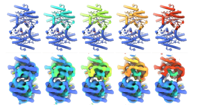
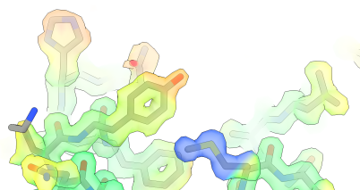
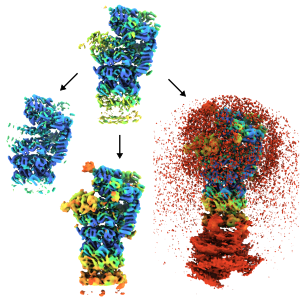
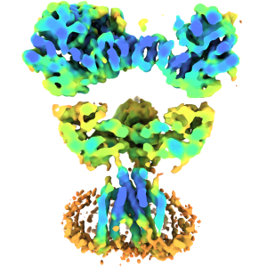
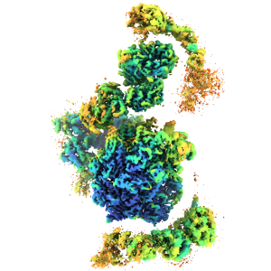
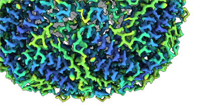
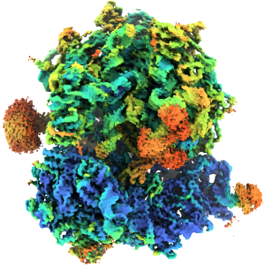
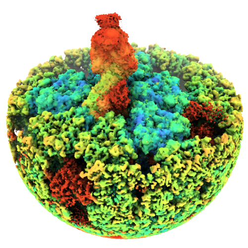

# Showcase / gallery 

Here you will find different examples of how Occupy has been used, and helped to visualise and analyze cryo-EM maps. 
The first section details how to use OccuPy to reproduce the images in the paper. If you have cases where it has 
been useful, please consider letting one of the developer know so that we can showcase it here. 

---

## From the Paper

These are examples of how figures were generated for the main OccuPy paper. In some cases instructions are provided 
to reproduce the results. 

    

    <a class="reference internal" href="synthetic" style="color:#FFFFFF;">
      
      

        

          
Synthetic input

            
PDB-1UXI

        

      
 
    </a>
    

    

    <a class="reference internal" href="mass" style="color:#FFFFFF;">
      
      

        

          
Mass effects

          
EMD-33707

        

      
    
    </a>
    
     

    

    <a class="reference internal" href="modification" style="color:#FFFFFF;">
      
      

        

          
Modification

          
EMD-14085

        

      
    
    </a>
    
   

    

    <a class="reference internal" href="membrane" style="color:#FFFFFF;">
      
      

        

          
Membrane

          
EMD-23015

        

      
    
    </a>
    

    

    <!--<a class="reference internal" href="resolution" style="color:#FFFFFF;">
    -->
      
      

        

          
Resolution   (COMING SOON)

          
EMD-13015

        

      
    
    </a>
    
  

---

## By the team 

    

    <a class="reference internal" href="highres" style="color:#FFFFFF;">
      
      

        

          
At high resolution

          
EMD-33707

        

      
    
    </a>
    
  

    

    <!--<a class="reference internal" href="ribosome" style="color:#FFFFFF;">
    -->
      
      

        

          
A ribosome   (COMING SOON)

          
EMD-3943

        

      
    
    </a>
    
  

    

    <!--<a class="reference internal" href="spike" style="color:#FFFFFF;">
    -->
    
      

        

          
A viral spike   (COMING SOON)

          
Unpublished data

        

      
    
    </a>
    
  

---

## By the community 

